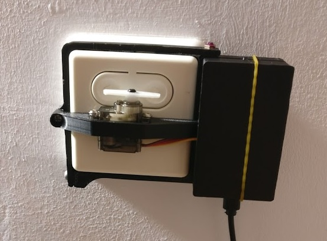

# Auto Window Shutters Manager

Automatically controls electric shutters depending on datetime and location (open after the sunrise and close on the sunset). 

The ESP-based hardware serves web-server for interaction (calibration and commands). Digest Authentication is used to reject the unauthorized access.

Only external scheduling (e.g. using external python script) supported atm.

### Dependencies
C++:
- [TimerLED](https://github.com/wi1k1n/TimerLED)
- Other dependencies listed in platformio.ini

Python 3.7:
- requests
- astral

### Hardware:
- ESP8266 ([NodeMCU](https://www.nodemcu.com/index_en.html))
- [Servo 9g](https://www.google.com/search?q=servo+9g&newwindow=1)
- 3D-printed frame (depends on shape of control panel) (3D model for my control box [available](/models))
